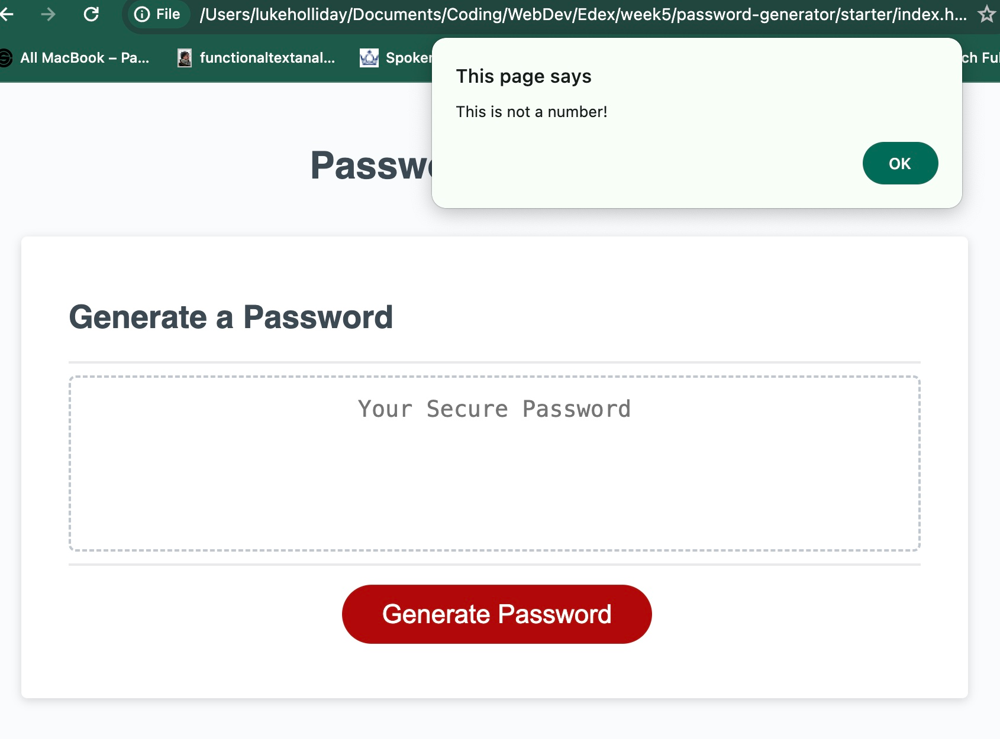

# Week 5 Homewor - Password Generator

## Links
GitHub Repo: https://github.com/thelukass88/password-generator 
Deployed Site: https://thelukass88.github.io/password-generator/

## Description
Using what I have learned recently in Javascript, I have used a series of variables and functions to generate a random password. The password characters will be selected by the user, based on a series of prompts, and will draw from one or more of a series of arrays which contain the chosen characters. 
## Table of Contents
* [Installation](#installation)
* [Useage](#useage)
* [Licence](#licence)
* [Contributions](#contributors)
* [Testing](#tests)
* [Questions](#questions)
* [Comments](#comments)
## Images

## Useage
To generate passwords quickly and randomly. 
## Licence
Your application is licenced under: MIT
## Contributions
Trent Keyes very supportive in Office Hours.
## Comments

This is my second submission of this project. 
Intially, I had struggled to validate the inputs from the confirm prompts. 
I had to work on my understanding of how to use functions to influence elements outside of themselves. 

## Tests
No
## Questions
If you would like to contact me 
visit: [github/thelukass88](https://github.com/thelukass88) 
email: l.holliday88@hotmail.com
